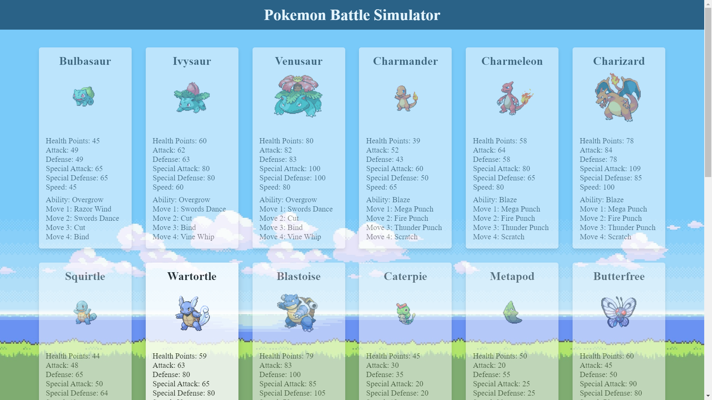
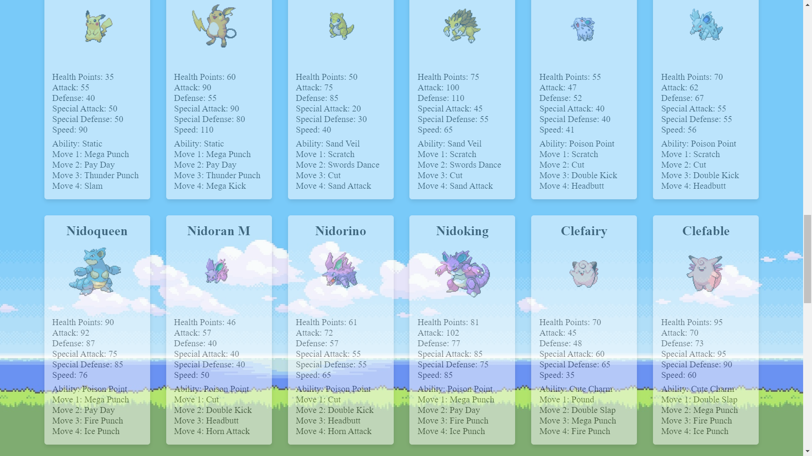
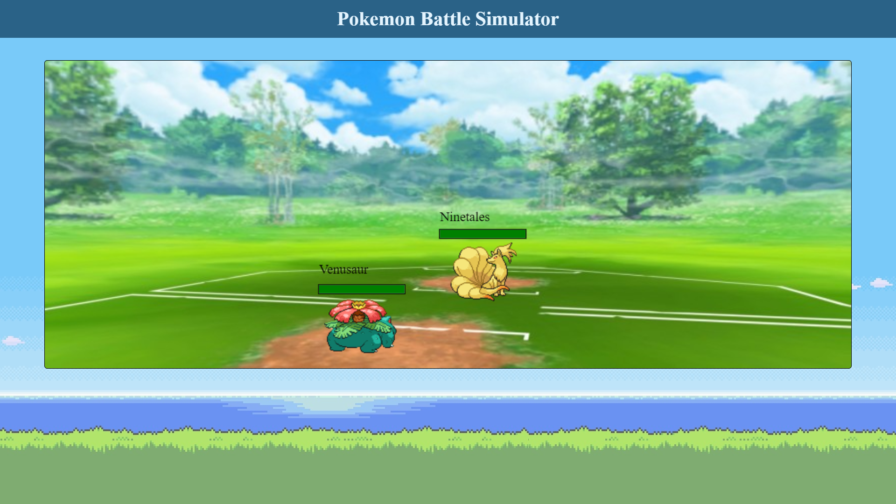
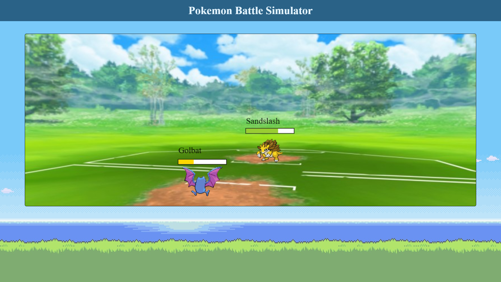
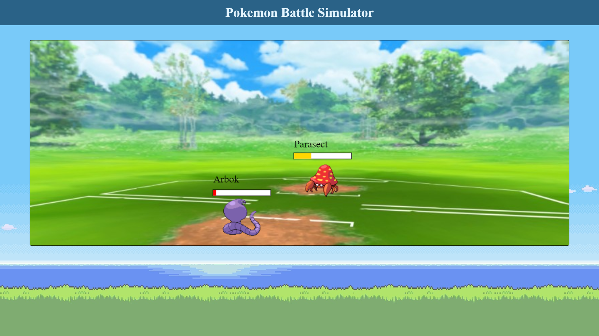
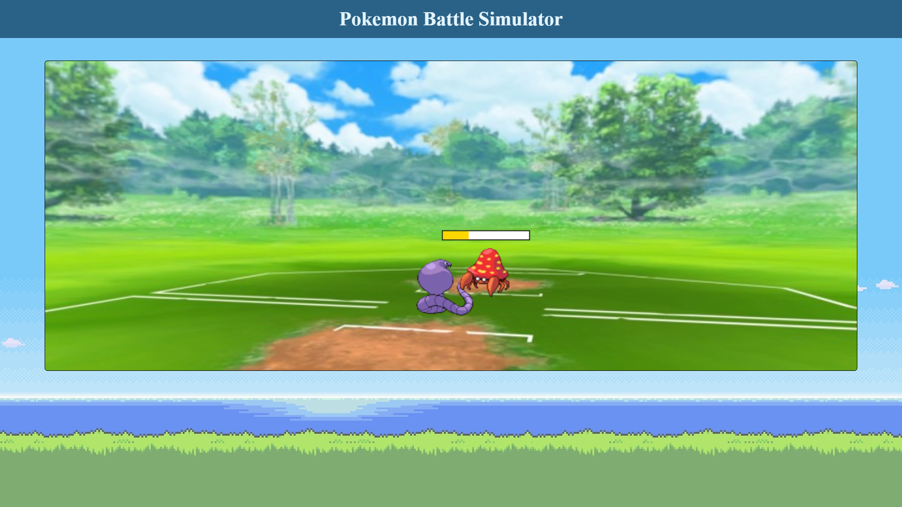

#### Pokemon Battle Simulator

A single-page application, that uses the PokéAPI. Users can choose a pokemon, at which point an opponent is randomly generated and they start to battle.

**Deployed project:**
https://pokemon-battle-simulator-bfb15.web.app/

#### Screenshots:

